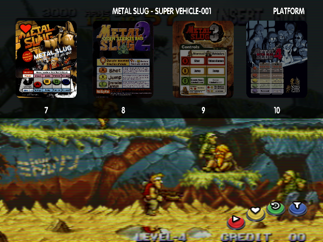

# mvscomplete layout for AttractMode front end

*v.02* by Keil Miller Jr [Keil Miller Jr](http://keilmillerjr.com)



## DESCRIPTION:

mvscomplete is a layout for the [AttractMode](http://attractmode.org) front end. It is designed as a better option than a 161-in-1 multicart for the neo geo mvs. It works well at vga (640x480) resolution.

## Requirements:

* AttractMode compatible device with AttractMode 2.2 installed
* Mame/GroovyMame installed with corresponding neogeo roms and bios

## Paths

You may need to change file paths as necessary if your differs.

## Install Files

1. copy layout files to ```$HOME/Apps/AttractModeFE/layouts/mvscomplete/```
2. The [Debug module](https://github.com/keilmillerjr/debug-module) is optional. It is recommended for debugging.
3. The [Shader module](https://github.com/keilmillerjr/shader-module) is RECOMMENDED. It is required for you to install it if you intend to use crt shaders within the layout, or have round corners on the slot artwork.
4. The [Helpers module](https://github.com/keilmillerjr/helpers-module) is REQUIRED for you to install. The layout will not work correctly without it.
5. The [MVS module](https://github.com/keilmillerjr/mvs-module) is REQUIRED for you to install. The layout will not work correctly without it.
6. The fade module is required. It is included with attractmode by default. No additional install is required.

## Config

* Edit the following files to somewhat match below, or you may use the config menu (tab) inside AttractMode to enter the values. Do not forget to generate the rom index and history index from the config menu.

File: ```$HOME/Apps/AttractModeFE/attract.cfg```

```
# Generated by Attract-Mode v2.2.0-3
#
display	Neo Geo
  layout               mvscomplete
  romlist              mame
  in_cycle             yes
  in_menu              yes
  global_filter        
    rule                 Category not_contains Majong
    rule                 Category not_contains Quiz
    rule                 Category not_contains Tabletop
  filter               All
  filter               Driving
    rule                 Category contains Driving
  filter               Fighter
    rule                 Category contains Fighter
  filter               Favorites
    rule                 Favourite equals 1
  filter               Maze
    rule                 Category contains Maze
  filter               Platform
    rule                 Category contains Platform
  filter               Puzzle
    rule                 Category contains Puzzle
  filter               Shooter
    rule                 Category contains Shooter
  filter               Sports
    rule                 Category contains Sports
  filter               Year
    sort_by              Year

sound
  sound_volume         100
  ambient_volume       100
  movie_volume         100

input_map
  configure            Tab
  back                 Escape
  back                 Joy0 Button1
  select               Return
  select               LControl
  select               Joy0 Button0
  screenshot           F12
  add_favourite        LAlt
  next_filter          LShift
  next_game            Right
  prev_game            Left
  right                Joy0 Right
  left                 Joy0 Left
  custom6              R
  up                   Up
  up                   Joy0 Up
  down                 Down
  down                 Joy0 Down
  default             back	exit
  default             up	
  default             down	
  default             left	prev_display
  default             right	next_display

general
  language             en
  exit_command         
  default_font         Arial
  font_path            /Library/Fonts/;$HOME/Library/Fonts/
  screen_saver_timeout 60
  displays_menu_exit   yes
  hide_brackets        yes
  startup_mode         default
  confirm_favourites   no
  mouse_threshold      10
  joystick_threshold   75
  window_mode          window_no_border
  filter_wrap_mode     default
  track_usage          yes
  multiple_monitors    yes
  smooth_images        yes
  accelerate_selection yes
  selection_speed_ms   40
  scrape_snaps         yes
  scrape_marquees      yes
  scrape_flyers        yes
  scrape_wheels        yes
  scrape_fanart        no
  scrape_videos        no
  scrape_mamedb        
  scrape_overview      
  video_decoder        software
  menu_prompt          Displays Menu
  menu_layout          

saver_config
  param                basic_movie No
  param                image_collage No
  param                movie_collage Yes
  param                overlay_art wheel
  param                preserve_ar No
  param                rgb_movie No
  param                sound Yes

intro_config
  param                detect_aspect Yes
  param                layout_rotation none
  param                play_intro No
  param                video_16x9 intro.mp4
  param                video_3x4 intro_3x4.mp4
  param                video_4x3 intro_4x3.mp4
  param                video_9x16 intro_9x16.mp4
  param                video_default intro.mp4


```

File: ```$HOME/Apps/AttractModeFE/emulators/mame.cfg```

```
# Generated by Attract-Mode v2.2.0-3
#
executable           /Applications/mame0183b_macOS/mame64
args                 [name] -bios unibios32 -video bgfx -bgfx_screen_chains crt-geom-deluxe
rompath              /Applications/mame0183b_macOS/roms/
romext               .zip;.7z;<DIR>
system               neogeo
info_source          listxml
import_extras        /Applications/mame0183b_macOS/catver.ini
artwork    flyer           /Applications/mame0183b_macOS/flyers
artwork    marquee         /Applications/mame0183b_macOS/marquees;/Applications/mame0183b_macOS/flyers
artwork    snap            /Applications/mame0183b_macOS/videos;/Applications/mame0183b_macOS/snaps
artwork    wheel           /Applications/mame0183b_macOS/wheel

```

## Artwork

Artwork can be obtained from the following, and neo geo artwork and roms can be extracted from full sets using [MAME Software Parser](https://github.com/keilmillerjr/mamesoftwareparser).

* [AntoPISA's MAME Artworks](http://www.progettosnaps.net/artworks/) for marquees
* [AntoPISA's progetto-SNAPS MAME Snapshots - Snap](http://www.progettosnaps.net/snapshots/) for snaps
* [Emumovies](http://emumovies.com) for videos
* [HypserSpin](http://www.hyperspin-fe.com) for wheel